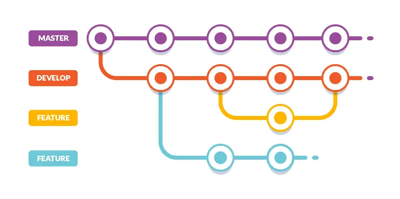

# Documentation Support Technique

Ce document contient les informations techniques nécessaires pour l'installation et le dépannage de notre logiciel de sauvegarde EasySave.

---

## Informations Générales

- **Version** : 1.0

**Outils et méthodes**

- Visual Studio 2026
- GitHub
- Revue de code automatisée par IA avec CodeRabbit, intégrée à notre dépôt GitHub : à chaque Pull Request, elle vérifie le respect des standards (100 % anglais, absence de chemins codés en dur), détecte les redondances et propose des refactorisations - Source : https://docs.coderabbit.ai/reference/configuration

**Langage, Framework et Outils utilisés**

- Langage : C#
- Framework : .NET 8.0
- Système d'exploitation : Windows (compatible cross-platform)
- Tests unitaires : xUnit - Source : https://xunit.net/?tabs=cs
- Formatage du code : .editorconfig

---

## Gitflow

Afin d'organiser au mieux notre projet, nous avons décidé de suivre un gitflow précis. Nous avons créé une branche "develop" à partir de "main", et des branches "features" pour chaque fonctionnalité du projet à partir de la branche "develop".

Source de l'image : https://buddy.works/blog/5-types-of-git-workflows

---

## Structure des Fichiers et Emplacements

L'application est portable. Tous les fichiers de configuration et de logs sont stockés dans le dossier où est présent l'exécutable `EasySave.exe`.

### 1. Configuration Générale

Les paramètres de l'application sont stockés au format JSON.

- **Emplacement** : `<Dossier_Application>/EasyLogs/config.json`
- **Paramètres** :
    - `LogFormat` : Format des logs (`Json` ou `Xml`)
    - `Language` : Langue de l'interface (`en` ou `fr`)
    - `IsEncryptionEnabled` : Activation du chiffrement CryptoSoft
    - `CryptExtensions` : Liste des extensions à chiffrer
    - `IsBusinessSoftwareCheckEnabled` : Activation de la détection de logiciel métier
    - `BusinessSoftwareNames` : Liste des noms de processus métier à surveiller
    - `IsPriorityEnabled` : Activation de la gestion des fichiers prioritaires
    - `PriorityFiles` : Liste des extensions prioritaires
    - `LargeFileThresholdKB` : Seuil (en Ko) pour la détection des gros fichiers
    - `UseLocalLog` : Booléen pour activer les logs locaux
    - `RemoteLogAddress` : Adresse IP du serveur de logs (EasyLogServer)
    - `RemoteLogPort` : Port TCP du serveur de logs (6767 par défaut)

### 2. Configuration des Travaux

Les travaux de sauvegarde sont stockés au format JSON.

- **Emplacement** : `<Dossier_Application>/EasyLogs/UserBackups.json`
- **Format** : Tableau JSON d'objets `BackupSaveDto` (Name, Source, Target, Type).
- **Note** : Si ce fichier est supprimé, la liste des travaux sauvegardés sera vide au prochain lancement.

### 3. Journaux d'Activité (Logs)

Chaque transfert de fichier génère une entrée de journal.

- **Emplacement** : `<Dossier_Application>/EasyLogs/DailyLog_{dd_MM_yyyy}.json` ou `.xml`
- **Format** : Un fichier par jour (JSON ou XML selon la configuration). Contient les détails :
    - `Timestamp`, `Name`, `Source`, `Target`, `FileSize`, `TransferTimeMs`, `CryptingTimeMs`
- **Rotation** : Les fichiers logs sont créés quotidiennement et actualisés en temps réel.

### 4. Fichier d'État (LiveLog)

L'état en temps réel des sauvegardes est écrit dans un fichier d'état.

- **Emplacement** : `<Dossier_Application>/EasyLogs/LiveLog.json` ou `.xml`
- **Contenu** : `Name`, `Source`, `Target`, `SizeFilesToTransfer`, `SizeFilesRemaining`, `NbFilesToTransfer`,
  `NbFilesRemaining`, `Progression`, `State` (Active/Inactive), `Timestamp`
- **Comportement** : Réécrit à chaque transfert de fichier et en fin de sauvegarde.

---

## Architecture et Conception Technique

### Structuration des Dossiers

L'application est divisée en plusieurs couches distinctes :

- **EasySave** (Application principale) :
    - `Backup/` : Stratégies de sauvegarde (`BackupBase`, `CompleteBackup`, `DifferentialBackup`).
    - `Services/` : Logique métier (`BackupManager`, `BackupExecutor`, `ConfigurationManager`, `ProcessChecker`,
      `CommandInterpreter`).
    - `UI/` : Interfaces utilisateur. 
        - `UIConsole.cs` : Interface console.
        - `UIGraphic.cs` : Interface graphique.
        - `Graphical/` : Vues et ViewModels Avalonia (MVVM).
    - `Models/` : Structures de données (`UserEntry`, `SourceFile`).
    - `Interfaces/` : Abstractions (`IBackup`, `IBackupManager`, `IObserver`).
    - `Resources/` : Fichiers de traduction (.resx) pour l'internationalisation FR/EN.

- **EasyLog.dll** (Bibliothèque de logs) :
    - `DailyLog` : Gestion des journaux quotidiens (JSON/XML).
    - `LiveLog` : Gestion du fichier d'état temps réel (JSON/XML).

### Design Patterns et Principes SOLID

- **Strategy Pattern** : Fichiers : IBackupStrategy.cs, FullBackupStrategy.cs, DifferentialBackupStrategy.cs
    - *Le problème* : Comment calculer la liste des fichiers à copier sans polluer le moteur de sauvegarde avec des algorithmes mathématiques complexes ?
    - *La solution* : On encapsule chaque algorithme dans sa propre classe. Le moteur appelle la méthode GetFilesToCopy() via l'interface IBackupStrategy. Le moteur se fiche de savoir comment la liste est calculée ; il sait juste qu'il va recevoir une liste de fichiers à copier. Si demain on veut ajouter une nouvelle sauvegarde, il suffit de créer une nouvelle classe sans toucher au reste du code.

- **Observer Pattern** : Fichiers : IBackupObserver.cs, StateLoggerObserver.cs, BackupEngine.cs
    - *Le problème* : Le moteur de sauvegarde (BackupEngine) copie des fichiers. Le fichier d'état (state.json) doit être mis à jour en temps réel (pour afficher une barre de progression). Mais le moteur ne doit pas être dépendant du système de log, sinon on casse le principe de responsabilité unique.
    - *La solution* : Le moteur agit comme une station radio : il "diffuse" son état d'avancement (NotifyObservers). Les classes qui sont intéressées s'y "abonnent". Ici, le StateLoggerObserver écoute le moteur et écrit dans le JSON à chaque notification. Le moteur fait son travail sans même savoir qui l'écoute !

- **Singleton Pattern** : Fichiers : Logger.cs
    - *Le problème* : L'écriture dans un fichier JSON (logs.json ou state.json) est une opération critique. Si deux travaux de sauvegarde tentaient d'écrire en même temps dans le même fichier, l'application crasherait à cause d'un conflit d'accès (File Lock).
    - *La solution* : Le Singleton garantit qu'il n'existe qu'une seule et unique instance de la classe Logger dans toute l'application. Grâce au mécanisme de verrouillage (lock (_lock)), il force tous les travaux à faire la queue pour écrire leurs informations un par un, garantissant la stabilité du programme.

- **Factory Pattern** : Fichiers : BackupFactory.cs
    - *Le problème* : L'application propose plusieurs types de sauvegardes (Complète, Différentielle). Si le moteur de sauvegarde (BackupEngine) devait instancier lui-même ces algorithmes avec des if ou des switch, il deviendrait complexe et devrait être modifié à chaque ajout d'un nouveau type de sauvegarde.
    - *La solution* : On délègue la création de l'objet à une "Usine". Le moteur dit simplement à la Factory : "J'ai besoin d'une sauvegarde de type X", et la Factory lui retourne le bon outil prêt à l'emploi.

- **Bridge Pattern** : Fichiers : IFileSystem.cs, LocalFileSystem.cs
    - *Le problème* : Si l'application utilise directement System.IO (les commandes Windows) partout, il est impossible de faire des tests unitaires sans créer de vrais fichiers sur le disque dur de l'ordinateur, ce qui est lent et dangereux.
    - *La solution* : On crée une interface (un pont) entre notre application et le système d'exploitation. En production, on utilise LocalFileSystem qui parle à Windows. En phase de test, on pourra injecter un "Faux" système de fichiers (Mock) qui fera croire à l'application qu'elle copie des fichiers, le tout en mémoire vive de manière instantanée.

- **Principes SOLID** : 
    - *S - Principe de Responsabilité Unique* : Une classe ne doit avoir qu'une seule et unique raison de changer (elle ne doit faire qu'une seule chose). Dans notre code, chaque fichier a donc un rôle strict et délimité (JobManager = liste des travaux et de sa sauvegarde en JSON mais ne copie pas de fichiers, BackupEngine = orchestre la copie mais ne sait pas comment sauvegarder un JSON, Logger = écrit que des logs).
    - *O - Principe Ouvert/Fermé* : Une classe doit être ouverte à l'extension, mais fermée à la modification. C'est ici que le Pattern Strategy agit. Si on nous demande d'ajouter un nouveau type de sauvegarde, nous n'aurons pas besoin de modifier la classe BackupEngine (fermée à la modification) mais nous allons simplement créer une nouvelle classe NewTypeBackupStrategy qui implémente IBackupStrategy (le code est ouvert à l'extension).
    - *L - Principe de Substitution de Liskov* : On doit pouvoir remplacer une classe parente (ou une interface) par n'importe laquelle de ses classes enfants sans que l'application ne plante ou n'ait un comportement anormal. Dans notre projet, le BackupEngine s'attend à recevoir une IBackupStrategy. Que la BackupFactory lui donne une FullBackupStrategy ou une DifferentialBackupStrategy, le moteur l'utilise exactement de la même manière en appelant GetFilesToCopy(). Le moteur ne fait aucune différence entre les deux, et le programme fonctionne parfaitement dans les deux cas. 
    - *I - Principe de Ségrégation des Interfaces* : Il vaut mieux avoir plusieurs petites interfaces très spécifiques plutôt qu'une seule énorme interface "fourre-tout". Un client ne doit pas être forcé d'implémenter des méthodes dont il ne se sert pas. Dans notre cas, nos interfaces sont toutes petites et ultra-ciblées (IBackupObserver ne contient que la méthode Update(), IBackupStrategy ne contient que GetFilesToCopy()).
    - *D - Principe d'Inversion des Dépendances* : Les modules de haut niveau (le moteur de l'application) ne doivent pas dépendre des modules de bas niveau (l'accès au disque dur ou à Windows). Les deux doivent dépendre d'abstractions (des interfaces). Dans notre code, c'est exactement le rôle du Pattern Bridge. BackupEngine (haut niveau) ne dépend plus directement de System.IO.File (bas niveau). Au lieu de ça, BackupEngine dépend de l'interface IFileSystem (l'abstraction).

L'architecture de l'application EasySave a été pensée autour des principes SOLID. L'utilisation conjuguée des interfaces (IFileSystem, IBackupStrategy) et des Design Patterns (Strategy, Bridge, Observer...) garantit un couplage faible entre nos composants. Ainsi, notre code est robuste, facilement testable unitairement, et prêt à évoluer vers les versions futures (ajout de nouveaux algorithmes ou d'une interface graphique) sans nécessiter de réécriture du moteur central.

---

## Intégrité et Tests

Nous avons accordé une grande importance à la qualité du code comme le montre la solution **`EasySaveTest`** qui couvre :

- **Tests Unitaires** :
    - *BackupJobTests* : 
        - Teste que l'instanciation d'un travail de sauvegarde affecte correctement le nom, les répertoires source et cible, ainsi que le type de sauvegarde en mémoire.
    - *BackupFactoryTests* : 
        - Teste que la fabrique logicielle retourne bien l'objet correspondant à l'algorithme de sauvegarde complète lorsqu'on lui passe le paramètre associé.
        - Teste que la fabrique logicielle retourne bien l'objet correspondant à l'algorithme de sauvegarde différentielle lorsqu'on lui passe le paramètre associé.
    - *LoggerTests* :
        - Teste que la classe de journalisation retourne strictement la même instance mémoire à chaque appel pour éviter tout conflit d'écriture dans le fichier de logs.
    - *JobManagerTests* : 
        - Teste que le gestionnaire ajoute correctement un nouveau travail à sa liste interne lorsque la capacité maximale n'est pas encore atteinte.
        - Teste qu'un travail de sauvegarde existant est bien retiré de la liste du gestionnaire lorsqu'une demande de suppression avec un index valide est effectuée.
        - Teste que la création de six travaux consécutifs pour prouver que le système bloque techniquement l'ajout au-delà de la limite stricte de cinq travaux imposée par le cahier des charges.
        - Teste que l'application ignore la requête et maintient sa stabilité sans planter si une tentative de suppression est effectuée avec un index hors limites.
    - *BackupEngineTests* : 
        - Teste que le moteur de sauvegarde s'arrête proprement et de manière sécurisée, sans provoquer d'erreur fatale, si le répertoire source fourni est physiquement introuvable.

L'objectif est de repérer rapidement les bugs, de prévenir les régressions quand on modifie le code, et de simplifier la maintenance du projet.